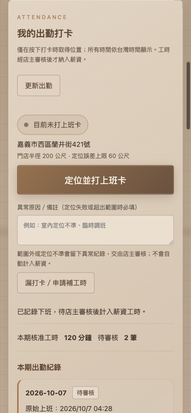

# ROU SPA 出勤打卡：功能與操作說明

## 本次完成

新增員工定位打卡、店主出勤審核、漏打卡／工時更正申請，核准後連動既有薪資工時。沿用員工帳號、現有人員與排班，以及目前咖啡色後台。沒有新增示範員工或正式庫的測試出勤。

### 入口

- **員工**：登入後按頂部「出勤打卡」，或「我的薪資與績效 → 我的出勤打卡」。
- **店主**：「人員與排班 → 出勤與打卡審核」，位於人員清單下方。
- **範圍設定**：店主在出勤審核區按「打卡範圍設定」。
- **薪資核對**：「薪資與提成」的核准工時與人員薪資明細。

員工導航維持營運首頁、預約與日程、評價、自己的薪資與績效。出勤查詢及更正申請由後端依登入帳號綁定的人員識別，不接受員工傳入另一位人員的 ID。

## 門店定位與設定

預設沿用官網地圖的地址：**嘉義市西區蘭井街421號**。

已由既有地址的 Google 地圖查詢核對標記位置，使用地點標記座標 `23.4768128, 120.4431785`，而非地圖畫面中心座標。[核對門店標記](https://www.google.com/maps?q=23.4768128,120.4431785)。

| 設定 | 正式預設 | 可設定範圍 | 用途 |
| --- | --- | --- | --- |
| 門店緯度／經度 | 23.4768128／120.4431785 | 合法地理座標 | 打卡範圍中心 |
| 打卡半徑 | 100 公尺 | 20～2000 公尺 | 判斷與中心距離 |
| 定位誤差上限 | 50 公尺 | 5～500 公尺 | 過大則記為異常 |
| 遲到／早退寬限 | 5 分鐘 | 0～60 分鐘 | 與打卡時班表比較 |
| 未下班異常門檻 | 1440 分鐘（24 小時） | 60～2880 分鐘 | 下班時標記過長班次 |

店主可編輯所有設定。修改後只影響新的打卡；每次打卡保存當時的中心、地址、範圍和規則。搬店時需同步核對官網門店資料及這裡的定位設定；修改地址文字不會自動重新地理編碼。

## 員工如何使用

1. 使用原本的員工使用者名稱和密碼登入。
2. 到店後按「定位並打上班卡」，允許瀏覽器取得此次位置。
3. 下班時按「定位並打下班卡」。如有不計薪休息，輸入休息分鐘數。
4. 下班紀錄進入「待審核」。店主核准後才變成薪資工時。
5. 漏打卡、忘記下班、時間有誤：按「漏打卡／申請補工時」，或該筆「申請補卡／更正」，填實際開始、結束、休息時間及原因。

時間顯示及輸入一律使用台灣時間。跨夜班的營業日以班表開始日為準。例如 10/8 20:00～10/9 02:00，凌晨打卡仍屬於 10/8。

### 定位異常怎麼處理

打卡會記錄距門店距離、定位誤差、原始位置及伺服器時間。超出範圍、誤差過大、誤差可能跨越範圍邊界、沒有當日排班、休假期間或提早超過一小時上班，必須填寫原因才可送出異常打卡。

定位權限被拒絕、裝置不支援或定位逾時時，頁面提供重試說明。員工也可以填原因送出沒有座標的異常打卡，或申請補打卡。這類紀錄不會自動核准工時。

遲到、早退及過長班次會標記供店主核對；不會自動扣薪。定位只在按打卡時取得，不會持續追蹤。

## 店主如何審核

1. 選期間及人員。預設先看待處理／上班中的紀錄，跨期未下班也會顯示。
2. 展開「原始打卡與定位紀錄」，查看位置、距離、誤差、當時範圍及員工說明。
3. 按「審核工時」，確認實際開始、結束、不計薪休息，填審核原因。
4. 選「核准工時」或「退回／撤回核准」。
5. 補打卡與更正申請另列在上方，按「審核申請」。核准申請後，同步建立或更新該人的工時。

原始打卡不會被更正覆蓋。頁面分開顯示原始時間、核算時間和審核原因；修改保存在既有稽核紀錄。單筆已有待審核申請時，不可重複申請；若紀錄在申請後又被更新，過期申請不能直接核准，請退回並重新申請。

## 與薪資數字的對應

只將**已核准**的出勤同步到原有 `spa_time_entries`，狀態為 `approved`。

```text
淨工時分鐘 = 向下取整（實際結束 − 實際開始，以分鐘計）− 不計薪休息分鐘
```

例如 10:00～18:00，休息 30 分鐘：`480 − 30 = 450 分鐘`。更正到 10:15～18:00，則是 `465 − 30 = 435 分鐘`。

- 下班待審核、退回及未結束出勤不計入薪資。
- 審核欄位未修改時，保留原始秒數，不因頁面顯示到分鐘而放大工時。
- 更正更新同一筆連動工時，不會新增第二筆工時。
- 與既有核准手動工時重疊時，後端阻止核准，避免重複計薪。
- 打卡生成的工時須由出勤審核更正，不能從原手動工時接口繞過審核。
- 已結算期間不能增減或更正工時，需先在薪資系統重新開啟該結算。
- **出勤工時與加班費分開**：出勤審核沒有自動新增加班費；加班仍由薪資系統的加班類型、倍率及核准流程處理。
- 原有職稱薪資、完成療程、實際技師、商品提成與加扣款規則繼續使用原資料來源。

若使用既有薪資資料重設，原始打卡保留；被重設的連動工時會撤回核准並回到待審核。需重新核准才能再次計薪。

## 權限與資料結構

| 資料 | 用途 |
| --- | --- |
| `spa_attendance_settings` | 門店範圍及異常門檻 |
| `spa_attendance` | 每次班次、班表快照、原始／核算時間、審核狀態及薪資工時連結 |
| `spa_attendance_events` | 不可由員工直接改寫的上下班事件、一次定位及當時規則 |
| `spa_attendance_requests` | 漏打卡與更正申請，以及店主審核結果 |

所有新表啟用 RLS，匿名及一般登入者沒有直接讀寫表的權限。透過受保護的 RPC，員工只查自己的資料，只有店主可查全部、審核和設定範圍。停用、封存或非在職人員不能使用員工打卡接口。

使用伺服器時間、防重試操作編號、每人只能有一筆未結束上班卡、並行鎖及審核版本檢查。精確位置不是對外公開資料。瀏覽器位置可能被模擬；本版本提供定位證據與店主審核，不能保證杜絕代打卡。

## 修改檔案

| 檔案 | 修改 |
| --- | --- |
| `src/Attendance.jsx` | 員工打卡、出勤明細、補卡申請、店主審核、範圍設定及 CSV |
| `src/lib/attendance.js` | 定位讀取、台灣時間轉換、狀態及淨工時計算 |
| `src/attendance.css` | 延續咖啡色風格，手機單欄布局 |
| `src/Admin.jsx` | 頂部打卡入口、傳遞本人查詢日期 |
| `src/StaffPortal.jsx` | 在自己的薪資與績效接入出勤 |
| `src/BusinessOS.jsx` | 在人員與排班接入店主審核 |
| `src/lib/spa.js` | 出勤相關中文錯誤及處理提示 |
| `supabase/migrations/202610060001_employee_attendance.sql` | 新表、權限、RPC、稽核與薪資工時保護 |
| `scripts/test-attendance.mjs`、`package.json` | 新增 53 項出勤驗證並加入 `npm test` |
| `public/fonts/*` | 補齊新文字的繁體中文字形，更新字型校驗清單 |

## 驗證與部署

- 全部資料庫遷移在本機 PostgreSQL 相容測試庫完整套用成功。
- `npm test` 通過，出勤 53 項測試涵蓋越權、重試、打卡狀態、薪資數字對應、更正、重複工時、結算保護、定位異常、跨夜班及停用人員。
- 既有預約、員工權限、帳號、營運系統、SEO、字型及日期測試通過。
- 瀏覽器以模擬帳號和模擬位置檢查上下班、本人四個權限入口、申請／設定彈窗。
- 員工與店主區在 320、390、768、1440 像素寬度沒有橫向溢出。
- Supabase 正式遷移已執行，SQL Editor 回報成功；匿名出勤接口回傳拒絕存取。
- 正式打卡／工資沒有寫入測試資料。真實手機的定位精度及權限仍需員工首次到店打卡時確認。

以下為手機介面的本機驗證截圖，使用測試資料；截圖中的 200 公尺／60 公尺來自測試修改設定。**正式預設為 100 公尺／50 公尺**。


